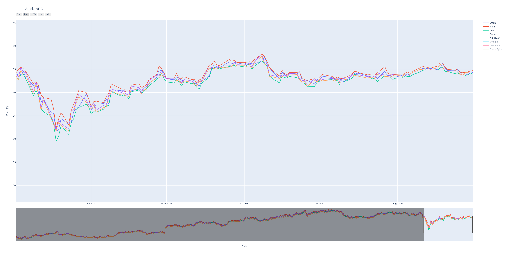
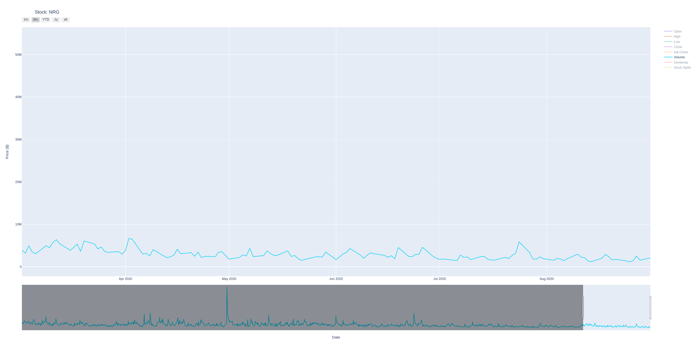
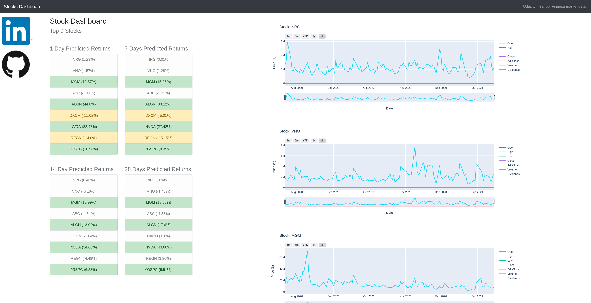

# Machine Learning Engineer Nanodegree
## Capstone Project
Marco Fagiani  
January 20st, 2020

## I. Definition
### Project Overview
Investment firms, hedge funds and even individuals have been using financial models to better understand market behavior and make profitable investments and trades. A wealth of  information is available in the form of historical stock prices and company performance data, suitable for machine learning algorithms to process.

The goal of this project is to build a stock price predictor that takes daily trading data over a certain date range as input, and outputs projected estimates for given query dates. The selected model should guarantee a percentage error of the prediction (in the training phase) lower than the 5%. Note that the inputs will contain multiple metrics, such as opening price (Open), highest price the stock traded at (High), how many stocks were traded (Volume) and closing price adjusted for stock splits and dividends (Adjusted Close); this system only needs to predict the Adjusted Close price.

In summary the project is divided in three main parts: 

- data retrieving;
- data modeling;
-  data visualization. 

The data retrieving is taking care of collect data from trusted source, clean them, combine with previous data and make them available to consumption of the others parts. 

The data modeling's main task is to perform analysis and to produce the model that will be used to predict the market returns for different time spans. This part is mainly developed to be run on demand by the user to update the models, using the same hyper-parameters as well as to provide all the methods to investigate and explore other solutions. 

Finally, the data visualization part provides a dashboard for the user to display historical data as well as the predictions achieved using up-to-date data. 


### Problem Statement

In order to produce any model the first step required is the collection of the data that will be used. Once a trusted source is selected the data must be analyzed to understand any issues within the data itself. Common problems are the presence of gaps in the data, fields reporting the same constant value, or fields with missing data. Moreover, begin the main goal to provide up-to-date prediction, the data must be updated with newest one on daily basis, avoiding the download of the whole required range every time.  

Aiming to produce a prediction of the future returns for different time spans, one thing to understand is the amount o data to be used, especially to train the model. Few data will produce a model with both poor performance and not representing the general phenomena, but only a specific path in the data. On the other hand, using the maximum amount of data available, without a proper split in train and test sets, could lead to produce poor performance (example, due to over-fitting the model on the training data), lack of specificity of the model as well as really long training times. Moreover, the extraction of meaningful features is another important step. Select the right feature, even just dropping of the original one, can help to reduce the number of used data (thus a faster training phase), as well as pointing to the development of features that maximize the knowledge.

Finally, the results must be presented to the final user, in yet comprehensive but understandable manner.


### Metrics
In this project have been adopted 3 metrics: mean squared error (MSE), mean absolute error (MAE) and mean absolute percentage error. Defined as:


$$
MSE = \frac{1}{n} \sum^{n}_{i=1} (y_i - \hat{y}_i)^2\\
MAE = \frac{\sum^{n}_{i=1} |y_i - \hat{y}_i|}{n}\\
MAPE = \frac{1}{n}\sum^{n}_{i=1}|\frac{y_i - \hat{y}_i}{y_i}|
$$
where, given a time-series $Y$ of $n$ elements, $y_i$ is the i-th actual value and $\hat{y}_i$ is the corresponding predicted value.

The MSE and the MAE are metrics commonly used to measure the regression performance, and thus have been kept to have a wide pool of metrics to perform the models evaluation. The MAPE has been selected because the target of the project is to select a model capable to achieve a prediction percentage error lower than 5%.


## II. Analysis
### Data Exploration

The project has been performed over the following set of stocks:

- Best Value Stocks 
  - NRG Energy Inc. ([NRG](https://www.investopedia.com/markets/quote?tvwidgetsymbol=NRG))
  - Vornado Realty Trust ([VNO](https://www.investopedia.com/markets/quote?tvwidgetsymbol=VNO))
  - MGM Resorts International ([MGM](https://www.investopedia.com/markets/quote?tvwidgetsymbol=MGM))
- Fastest Growing Stocks
  - AmerisourceBergen Corp. ([ABC](https://www.investopedia.com/markets/quote?tvwidgetsymbol=ABC))
  - MGM Resorts International (MGM)
  - Align Technology Inc. ([ALGN](https://www.investopedia.com/markets/quote?tvwidgetsymbol=ALGN))
- Stocks with the Most Momentum
  - DexCom Inc. ([DXCM](https://www.investopedia.com/markets/quote?tvwidgetsymbol=DXCM))
  - NVIDIA Corp. ([NVDA](https://www.investopedia.com/markets/quote?tvwidgetsymbol=NVDA))
  - Regeneron Pharmaceuticals Inc. ([REGN](https://www.investopedia.com/markets/quote?tvwidgetsymbol=REGN))
  - S&P 500

Considered the Top Stock till mid-2020 ((Investopedia)[https://www.investopedia.com/top-stocks-4581225]).

The stock data are retrieved using the Yahoo! Finance API (https://pypi.org/project/yfinance/) and leveraging over the historical end-point to obtain the following data:

```
             Open   High    Low  Close  Adj Close   Volume  Dividends  Stock Splits
Date                                                                               
2009-12-31  23.90  24.00  23.61  23.61      20.67  1024900        0.0             0
2010-01-04  23.78  24.13  23.70  23.87      20.89  1683700        0.0             0
2010-01-05  23.96  24.28  23.81  24.24      21.22  3473400        0.0             0
2010-01-06  24.25  24.79  24.11  24.77      21.68  2719300        0.0             0
2010-01-07  24.79  25.24  24.73  24.91      21.80  3200800        0.0             0
```

Basically, the query is performed from the current UTC datetime back till the required range is obtained. The raw data is then stored in a dedicated CSV, for each symbol. In further queries are performed, if the CSV already exists, at first the data are read from it and only for the missing date range a new query toward the provider is performed. In case of a new query, the new data are integrate with the CSV one, and re-stored into the same CSV.

#### Data cleaning

As said, the raw data are stored in to CSV. A cleaning procedure is performed only on the data before the utilization in the training, test, prediction phases. The only abnormality in the data is the presence of two columns, Dividends and Stock Splits, composed of only 0 values. Therefore, these columns are dropped in a dedicated clean function that detects columns with all equal values.

```python
def is_unique(s):
    a = s.to_numpy() # s.values (pandas<0.24)
    return (a[0] == a).all()


def clean_data(data):
    """ remove nans or constant values columns, or drop equals columns"""

    for col_name in list(data.columns):
        if is_unique(data[col_name]):
            logger.info(f"Column {col_name} has unique values..removed.")
            data.drop(columns=col_name, inplace=True)
```


### Exploratory Visualization

Here below is reported the last 6 months of prices (open, close, high, low, adj) and volume for the symbol NRG. 






#### Dashboard

The developed dashboard displays the expected returns (predictions) a head of 1, 7, 14, and 28 days for each symbol. Also a visualization of the past data and the predictions is provided in graphs.  




### Algorithms and Techniques

#### Data Normalization

Once the data is clean (see below), the next step is to normalize the data. The normalization process can affects the data range (i.e., simple compression or expansion to get data in the [0, 1] range) or alters the data statistics, mean and variance.

##### Min-Max normalization (Normalizer)

Min-max normalization is one of the most common ways to normalize data. For every feature, the minimum value of that feature gets transformed into a 0, the maximum value gets transformed into a 1, and every other value gets transformed into a decimal between 0 and 1. 


$$
\hat{x} = \frac{x - x_{min}}{(x_{max} - x_{min})}
$$


##### Mean and Variance Normalization (StandardScaler)

This normalization ensures that the input is transformed to obtain an mean of the output data approximately zero, while the standard deviation (as well as the variance) is in a range close to unity. Given with $\mu, \sigma$ the mean and the variance of the input data, the output data is:
$$
\hat{x} = \frac{x- \mu}{\sigma}
$$


#### Support Vector Regression

The Support Vector Regression approach (SVR or SVM regression) is derived from the Support Vector Machine technique. The SVMs are binary classifiers that discriminate whether an input vector x belongs to class +1 or to class −1 based on the following discriminant function:
$$
f(x) = \sum^{N}_{i=1} \alpha_i \cdot t_i \cdot K(\mathbf{x}, \mathbf{x_i}) + d
$$
where $t_i \in {+1, -1}, $ $\alpha_i > 0$ and $\sum^{N}_{i=1} \alpha_i · t_i = 0$. The terms $\mathbf{x}_i$ are the “support vectors” and $d$ is a bias term that together with the $\alpha_i$ is determined during the training process of the SVM. The input vector $\mathbf{x}$ is classified as +1 if f(x) ≥ 0 and −1 if $f(x) < 0$. The kernel function $K(·, ·)$ can assume different forms.

Differently from the SVM, the solution of the optimization problem of a linear model (in the feature space) for the SVR is given by:
$$
f(x) = \sum^{N}_{i=1} (\alpha_i - \alpha_i^{*}) \cdot K(\mathbf{x}, \mathbf{x_i}) + d
$$
where, $\sum^{N}_{i=1} (\alpha_i - \alpha_i^{*}) = 0$ with $\alpha_i, \alpha_i^{*} \in [0, C]$.

The kernel types to be evaluated are the linear and the radial basis function (RBF). A linear kernel expresses a normal dot product of any two given observations, thus $K(x, xi) = (x \times xi)$. Instead, the RBF can map an input space in infinite dimensional space, where $K(u, v) = \exp^{−\gamma (x − x_i^2 )}$. The $\gamma$ and $C$ parameters, and the chosen kernel are crucial to obtain the best performance.  


#### Cross Validation


steps:

- simple split 70%/30% with default params to evaluate:
  - train length
  - normalization type
  - feature selection and evaluation
- finally, CV 70/30 over set of parameters
- 

#### 


###################

In this section, you will need to discuss the algorithms and techniques you intend to use for solving the problem. You should justify the use of each one based on the characteristics of the problem and the problem domain. Questions to ask yourself when writing this section:
- _Are the algorithms you will use, including any default variables/parameters in the project clearly defined?_
- _Are the techniques to be used thoroughly discussed and justified?_
- _Is it made clear how the input data or datasets will be handled by the algorithms and techniques chosen?_

### Benchmark
In this section, you will need to provide a clearly defined benchmark result or threshold for comparing across performances obtained by your solution. The reasoning behind the benchmark (in the case where it is not an established result) should be discussed. Questions to ask yourself when writing this section:
- _Has some result or value been provided that acts as a benchmark for measuring performance?_
- _Is it clear how this result or value was obtained (whether by data or by hypothesis)?_


## III. Methodology
_(approx. 3-5 pages)_

### Data Preprocessing


```
data = get_daily_historical(symbol, start_date, end_date)
data = clean_data(data)
samples, targets = prepare_data(data, delays=prediction_horizons, diffs=prediction_horizons)
```


```


pipeline = Pipeline([
    ('scaler', StandardScaler()),
    # ('scaler', Normalizer()),
    ('regres', MultiOutputRegressor(SVR(), n_jobs=num_cpus))
    # ('regres', SVR())
])
```


#####

In this section, all of your preprocessing steps will need to be clearly documented, if any were necessary. From the previous section, any of the abnormalities or characteristics that you identified about the dataset will be addressed and corrected here. Questions to ask yourself when writing this section:

- _If the algorithms chosen require preprocessing steps like feature selection or feature transformations, have they been properly documented?_
- _Based on the **Data Exploration** section, if there were abnormalities or characteristics that needed to be addressed, have they been properly corrected?_
- _If no preprocessing is needed, has it been made clear why?_

### Implementation
In this section, the process for which metrics, algorithms, and techniques that you implemented for the given data will need to be clearly documented. It should be abundantly clear how the implementation was carried out, and discussion should be made regarding any complications that occurred during this process. Questions to ask yourself when writing this section:
- _Is it made clear how the algorithms and techniques were implemented with the given datasets or input data?_
- _Were there any complications with the original metrics or techniques that required changing prior to acquiring a solution?_
- _Was there any part of the coding process (e.g., writing complicated functions) that should be documented?_

### Refinement
In this section, you will need to discuss the process of improvement you made upon the algorithms and techniques you used in your implementation. For example, adjusting parameters for certain models to acquire improved solutions would fall under the refinement category. Your initial and final solutions should be reported, as well as any significant intermediate results as necessary. Questions to ask yourself when writing this section:
- _Has an initial solution been found and clearly reported?_
- _Is the process of improvement clearly documented, such as what techniques were used?_
- _Are intermediate and final solutions clearly reported as the process is improved?_


## IV. Results
_(approx. 2-3 pages)_


preliminary results

features: Open   High    Low  Close   Volume  Dividends

```
start_date = datetime.datetime(2016, 1, 1)
end_date = datetime.datetime(2020, 8, 31)
```

SVR, lags 1, 7, 14, 28 days

StandardScaler

Lags:	MSE					MAE					MAPE
1		0.626912299976345	0.5582189129997621	2.416236670649339
7		2.332313971001829	1.1049456118946013	4.676439973038423
14		4.838131098589591	1.5033607703336376	6.436437982354256
28		7.993082818960331	2.0478312271443424	8.355871529407466


No-StandardScaler

Lags:	MSE					MAE					MAPE
1		99.53960422452325	7.998992042098148	44.34350605845658
7		100.57144584084791	7.967557069736896	44.132938129023955
14		102.50652110783254	7.996977366226525	44.266408807832754
28		105.08659083725391	8.11109606332413	44.793733241936714


Normalizer

Lags:	MSE					MAE					MAPE
1		113.63390428314175	9.059978374918849	52.39440628045821
7		113.68015149831623	8.995986955717427	52.26330988354362
14		112.24867948896319	8.935192975331292	50.92427483733033
28		110.05762176582907	8.733669393850528	49.794269825608914

NOTE: possible overfitting.


```
start_date = datetime.datetime(2016, 1, 1)
end_date = datetime.datetime(2016, 8, 31)
```

Lags:	MSE					MAE					MAPE
1		0.21112927156271136	0.37523306125488903	3.0149988073730505
7		0.9633320729430199	0.8199542632833591	6.313100574278932
14		1.5922181030069802	1.0037223960198722	8.593046278801905
28		2.4346789468526486	1.1750657488671215	9.416518995355002


```
start_date = datetime.datetime(2016, 1, 1)
end_date = datetime.datetime(2016, 12, 31)
```

Lags:	MSE					MAE					MAPE
1		0.3428503306533554	0.40544449958887946	3.6652744668904482
7		1.0051177815069758	0.8231350085416825	7.443305532119241
14		1.5062068987884345	0.8968363564593299	7.329102318715586
28		1.7895787325568986	1.102088804071032	9.328303798479803


feature: diff1

StandardScaler

Lags:	MSE					MAE					MAPE
1		0.36669773086460056	0.45297885361674617	3.619969766501647
7		0.749254108921726	0.6783870391112133	5.657035325985173
14		1.268399874674519	0.9073602307483047	7.268402714150348
28		1.5508917218399683	0.9910303857011965	7.813861691404567


features: diffs 1, 7, 14, 28

StandardScaler
Lags:	MSE					MAE					MAPE
1		0.7962109430306652	0.7286437048516999	5.8249287556292195
7		1.179714232585351	0.9111768784145695	7.189293378802374
14		1.5217420461439597	0.9374409230131214	7.186396300825066
28		0.8323427613932317	0.7015674273915439	5.577134421323211

Data whole 2019, diffs 1, 7, 14, 28

Lags:	MSE					MAE					MAPE
1		1.7562137972869911	0.962691338237324	2.568557641027029
7		2.2985211451490803	1.228914921126642	3.290635098739097
14		2.747151380271036	1.409364621494489	3.773832904051618
28		2.5268049168683753	1.271901920962301	3.538059109430679


Data 2019 to 2020, , diffs 1, 7, 14, 28
Lags:	MSE					MAE					MAPE
1		4.82934905276741	1.1888728303878993	3.9008009968905313
7		4.652657943697871	1.544229815023094	4.656086100677316
14		5.175249124908902	1.642209472120122	4.872984421744059
28		10.398085779271335	2.1716518331996855	6.763336131235401

Lags:	MSE					MAE					MAPE
1		3.835094405117715	1.0651720419597108	3.42535101932008
(1		2.45342861429535	0.8386575102847726	2.678952727416385)
7		5.518033906677147	1.568273854697974	4.927039850973423
(7		3.198372888852507	1.1310044510023152	3.4788181871104182)
14		7.895454690215884	1.8717983715665645	6.085575597826609
(14		3.880822665050928	1.2619526978010462	3.854980678288967)
28		8.855096935427957	2.0899292446352535	6.675513946786582
(28		7.837095868293962	1.6705011837333177	5.3503191155923195)
Saving model...


4 months of data
INFO:root:Partial range requested to provider: 2020-09-19 00:00:00 to 2020-09-20 10:19:37.056651
INFO:root:Received dates already present.
INFO:__main__:Column Stock Splits has unique values..removed.
Building model...
Training model...
Evaluating model...
Lags:	MSE					MAE					MAPE
1		0.09041333844697619	0.30068810825667214	0.8771531746110622
(1		0.009929085895203792	0.09964471946468952	0.2878692568985732)
7		0.04112422471027988	0.20279108636791676	0.574478998209396
(7		0.010029321796328764	0.10014612852144704	0.2823047084033788)
14		0.0516940043738091	0.2273631552688542	0.6698973343219039
(14		0.010029769802246688	0.10014835380828657	0.2929226087491712)
28		0.35993189582793844	0.5999432438388972	1.9403080331141564
(28		0.01008392809625136	0.10041865457860648	0.33083405078586176)


6 months of data
INFO:root:Partial range requested to provider: 2020-09-19 00:00:00 to 2020-09-20 10:18:19.005585
INFO:root:Received dates already present.
INFO:__main__:Column Stock Splits has unique values..removed.
Building model...
Training model...
Evaluating model...
Lags:	MSE					MAE					MAPE
1		0.27379073702478796	0.3706917553979025	1.107260806121809
(1		0.3515633201644313	0.2813358024824141	0.8078950620815272)
7		1.3118976998941505	0.9468353465848182	2.78388958348914
(7		0.09718952628494888	0.1913696857523749	0.5581547167148168)
14		0.49841681399486815	0.5727347302208969	1.6905102298801755
(14		0.08305644104691697	0.17122082716712464	0.5055913188020039)
28		1.6654831699018948	0.8983777152133395	2.834438535764479
(28		0.5397337615021407	0.38918745452732373	1.2146702810344183)
Saving model...
    MODEL: test.dump
    
    
9 months of data
INFO:root:Partial range requested to provider: 2020-09-19 00:00:00 to 2020-09-20 10:18:55.544242
INFO:root:Received dates already present.
INFO:__main__:Column Stock Splits has unique values..removed.
Building model...
Training model...
Evaluating model...
Lags:	MSE					MAE					MAPE
1		4.329030067375523	1.5136511240804693	5.2783027551416755
(1		3.7551861090084526	1.1666802933004141	4.204243143496817)
7		8.327019578296868	2.1314983830368543	7.326433806640775
(7		3.054815218407068	1.0030336006453628	3.37832276945032)
14		4.709876358915432	1.7143741661978142	5.468094229508142
(14		1.907153855795759	0.8806746103318818	2.7475377482510006)
28		2.109193810464049	1.1234313965091065	3.4335442571221524
(28		1.2031941538759559	0.723600261822423	2.194958275249188)
Saving model...


CORRECT
test fixed to 30 points (~30gg)

6 months of data (lower)
INFO:root:Partial range requested to provider: 2020-09-19 00:00:00 to 2020-09-20 10:25:59.895263
INFO:root:Received dates already present.
INFO:__main__:Column Stock Splits has unique values..removed.
Building model...
Training model...
Evaluating model...
Lags:	MSE					MAE					MAPE
1		0.9533968191567503	0.550888642117904	1.588186524503701
(1		0.24171096389294827	0.2872608200823117	0.8561987878204682)
7		0.6590286200460067	0.6496822668882734	1.9407164644430694
(7		0.0969904652668242	0.2348477134197915	0.6851370712219627)
14		0.7271535933426745	0.6737909436138125	2.0221963633229105
(14		0.04830485853518916	0.1638584733484416	0.4763079373466513)
28		1.0120074081347183	0.692683368687584	2.1289972883552966
(28		1.1006193328277025	0.626815439791526	1.966588996650763)

9 months of data
INFO:root:Partial range requested to provider: 2020-09-19 00:00:00 to 2020-09-20 10:26:57.308842
INFO:root:Received dates already present.
INFO:__main__:Column Stock Splits has unique values..removed.
Building model...
Training model...
Evaluating model...
Lags:	MSE					MAE					MAPE
1		4.407916361996269	1.561400903899289	5.39261167261359
(1		4.325519742027325	1.227315512548382	4.475876665800974)
7		7.019567956554122	1.9341061653983145	6.487701047606066
(7		3.2701858726558037	1.048238837783367	3.551520309220694)
14		4.233007860427572	1.6400410827569567	5.175446593012515
(14		1.9581559965996558	0.8812625142366561	2.757690065342179)
28		2.0013123975935505	1.1547148380751522	3.4818248987029032
(28		1.2583487501560817	0.7385261573246042	2.2338158086079063)
Saving model...


12 months of data

INFO:root:Partial range requested to provider: 2020-09-19 00:00:00 to 2020-09-20 10:27:25.221924
INFO:root:Received dates already present.
INFO:__main__:Column Stock Splits has unique values..removed.
Building model...
Training model...
Evaluating model...
Lags:	MSE					MAE					MAPE
1		4.590757028609596	1.5218136904201964	4.990049119278036
(1		3.582764662082393	1.1266231028902747	3.788171241683819)
7		6.34985333608511	1.7215401977636402	5.524469129511114
(7		5.257555540518188	1.4950260941694318	4.7910697520409915)
14		7.794967582048785	2.2792494643091987	7.079663814312148
(14		6.617617565032497	1.607977229055129	5.350584049993421)
28		9.927105324752239	2.4589496899371825	7.4721094863731725
(28		10.104317622175449	1.91151869391544	6.615722120897891)
Saving model...


15 months

INFO:root:Partial range requested to provider: 2020-09-19 00:00:00 to 2020-09-20 10:27:50.715272
INFO:root:Received dates already present.
INFO:__main__:Column Stock Splits has unique values..removed.
Building model...
Training model...
Evaluating model...
Lags:	MSE					MAE					MAPE
1		3.2392803909384473	1.2791629376384719	4.086094797825156
(1		3.2060570885817183	0.9982155172713285	3.319766129055621)
7		8.223035765794222	1.828664653002194	6.3660117822908
(7		3.7891908169670567	1.2023929195324035	3.8035261098150226)
14		3.9884095510787034	1.4200705900735757	4.392582283400434
(14		5.8594444109160975	1.4306136064004091	4.706874711479915)
28		17.94642363195005	2.6821158818739055	9.376037015540758
(28		9.190016868446406	1.7337760756723244	5.790761054221706)


18 months
INFO:root:Partial range requested to provider: 2020-09-19 00:00:00 to 2020-09-20 10:28:14.296748
INFO:root:Received dates already present.
INFO:__main__:Column Stock Splits has unique values..removed.
Building model...
Training model...
Evaluating model...
Lags:	MSE					MAE					MAPE
1		1.7477816657461984	0.8913705555173123	2.7503367227166136
(1		2.735367252169846	0.8586828291336158	2.852311793826318)
7		4.581061940114523	1.2642035846787079	4.045202245872913
(7		3.462179803761099	1.2051556675761057	3.7854403171384026)
14		5.264854023625132	1.6454889103435153	5.080189659955582
(14		4.72944925369994	1.348841253037393	4.26797529267095)
28		9.544615345377498	1.9759231757525855	6.27763712587838
(28		8.273296600935081	1.7378347380984995	5.625612774717765)

24 months
INFO:root:Partial range requested to provider: 2020-09-19 00:00:00 to 2020-09-20 10:28:40.598374
INFO:root:Received dates already present.
INFO:__main__:Column Stock Splits has unique values..removed.
Building model...
Training model...
Evaluating model...
Lags:	MSE					MAE					MAPE
1		4.419071326061516	1.190392815932054	3.8130327721096346
(1		3.0241176463984223	0.8663691148872869	2.761406376670259)
7		11.289722619267396	2.174686256093984	7.394900928103641
(7		3.6788820251483525	1.2262268121798303	3.6721683193968886)
14		6.200968071117036	1.8744006128333903	5.553293627350579
(14		5.400474718598246	1.524086633094954	4.570278910039392)
28		16.05688066315602	2.9064150437706116	9.233620078518832
(28		8.586376743363	1.916283752270033	5.795838152894383)


FIXED DIFF FEATURES

6month (tra parentesi performance su trainig set)

Lags:	MSE					MAE					MAPE
1		0.35380435899954765	0.41975376758182276	1.218330470939107
(1		0.23680639189189742	0.19646725586952649	0.5591343338897765)
7		0.9247276754318807	0.6937956849682727	2.0544295442204477
(7		0.3742589197446078	0.29136164860733443	0.889764306062578)
14		1.3588926651650517	0.8643135447263328	2.6347638040317753
(14		1.581130561538006	0.7097295697039245	2.2910936314304786)
28		0.8454111833074267	0.7202116796426371	2.2367703964652037
(28		0.25709854643311725	0.2704983001137954	0.8824881375121522)
Best params:
{'regres__estimator__C': 1.6999999999999997, 'regres__estimator__epsilon': 0.02, 'regres__estimator__kernel': 'rbf'}
Saving model...
    MODEL: test.dump

### Model Evaluation and Validation
In this section, the final model and any supporting qualities should be evaluated in detail. It should be clear how the final model was derived and why this model was chosen. In addition, some type of analysis should be used to validate the robustness of this model and its solution, such as manipulating the input data or environment to see how the model’s solution is affected (this is called sensitivity analysis). Questions to ask yourself when writing this section:
- _Is the final model reasonable and aligning with solution expectations? Are the final parameters of the model appropriate?_
- _Has the final model been tested with various inputs to evaluate whether the model generalizes well to unseen data?_
- _Is the model robust enough for the problem? Do small perturbations (changes) in training data or the input space greatly affect the results?_
- _Can results found from the model be trusted?_

### Justification
In this section, your model’s final solution and its results should be compared to the benchmark you established earlier in the project using some type of statistical analysis. You should also justify whether these results and the solution are significant enough to have solved the problem posed in the project. Questions to ask yourself when writing this section:
- _Are the final results found stronger than the benchmark result reported earlier?_
- _Have you thoroughly analyzed and discussed the final solution?_
- _Is the final solution significant enough to have solved the problem?_


## V. Conclusion
_(approx. 1-2 pages)_

### Free-Form Visualization
In this section, you will need to provide some form of visualization that emphasizes an important quality about the project. It is much more free-form, but should reasonably support a significant result or characteristic about the problem that you want to discuss. Questions to ask yourself when writing this section:
- _Have you visualized a relevant or important quality about the problem, dataset, input data, or results?_
- _Is the visualization thoroughly analyzed and discussed?_
- _If a plot is provided, are the axes, title, and datum clearly defined?_

### Reflection
In this section, you will summarize the entire end-to-end problem solution and discuss one or two particular aspects of the project you found interesting or difficult. You are expected to reflect on the project as a whole to show that you have a firm understanding of the entire process employed in your work. Questions to ask yourself when writing this section:
- _Have you thoroughly summarized the entire process you used for this project?_
- _Were there any interesting aspects of the project?_
- _Were there any difficult aspects of the project?_
- _Does the final model and solution fit your expectations for the problem, and should it be used in a general setting to solve these types of problems?_

### Improvement
In this section, you will need to provide discussion as to how one aspect of the implementation you designed could be improved. As an example, consider ways your implementation can be made more general, and what would need to be modified. You do not need to make this improvement, but the potential solutions resulting from these changes are considered and compared/contrasted to your current solution. Questions to ask yourself when writing this section:
- _Are there further improvements that could be made on the algorithms or techniques you used in this project?_
- _Were there algorithms or techniques you researched that you did not know how to implement, but would consider using if you knew how?_
- _If you used your final solution as the new benchmark, do you think an even better solution exists?_

-----------

**Before submitting, ask yourself. . .**

- Does the project report you’ve written follow a well-organized structure similar to that of the project template?
- Is each section (particularly **Analysis** and **Methodology**) written in a clear, concise and specific fashion? Are there any ambiguous terms or phrases that need clarification?
- Would the intended audience of your project be able to understand your analysis, methods, and results?
- Have you properly proof-read your project report to assure there are minimal grammatical and spelling mistakes?
- Are all the resources used for this project correctly cited and referenced?
- Is the code that implements your solution easily readable and properly commented?
- Does the code execute without error and produce results similar to those reported?
