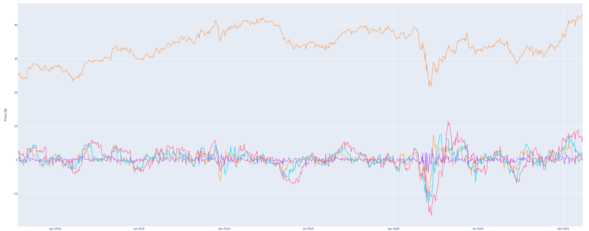
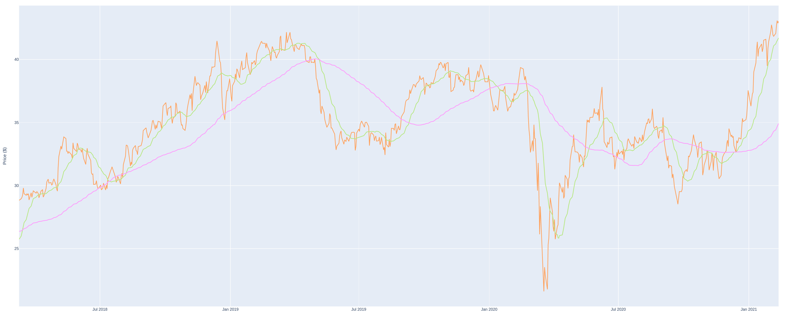
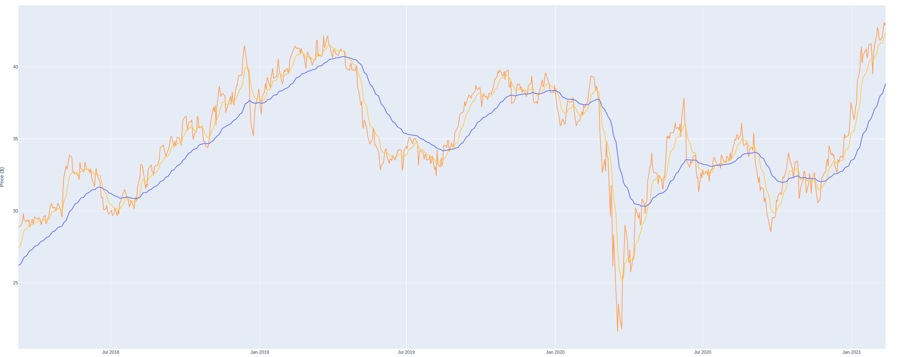
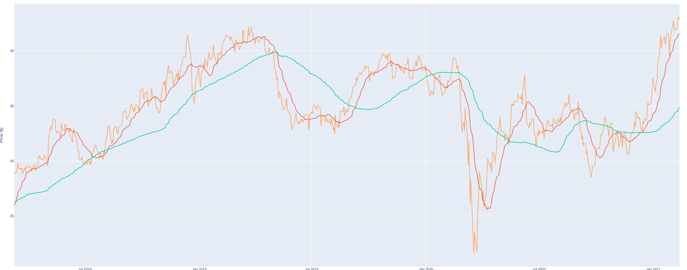

Machine Learning Engineer Nanodegree

## Capstone Project
Marco Fagiani  
February 7st, 2021

## I. Definition
### Project Overview
Investment firms, hedge funds and even individuals have been using financial models to better understand market behavior and make profitable investments and trades. A wealth of  information is available in the form of historical stock prices and company performance data, suitable for machine learning algorithms to process.

The goal of this project is to build a stock price predictor that takes daily trading data over a certain date range as input, and outputs projected estimates for given query dates. The selected model should guarantee a percentage error of the prediction (in the training phase) lower than the 5%. Note that the inputs will contain multiple metrics, such as opening price (Open), highest price the stock traded at (High), how many stocks were traded (Volume) and closing price adjusted for stock splits and dividends (Adjusted Close); this system only needs to predict the Adjusted Close price.

In summary the project is divided in three main parts: 

- data retrieving;
- data modeling;
-  data visualization. 

The data retrieving is taking care of collect data from trusted source, clean them, combine with previous data and make them available to consumption of the others parts. 

The data modeling's main task is to perform analysis and to produce the model that will be used to predict the market returns for different time spans. This part is mainly developed to be run on demand by the user to update the models, using the same hyper-parameters as well as to provide all the methods to investigate and explore other solutions. 

Finally, the data visualization part provides a dashboard for the user to display historical data as well as the predictions achieved using up-to-date data. 


### Problem Statement

In order to produce any model the first step required is the collection of the data that will be used. Once a trusted source is selected the data must be analyzed to understand any issues within the data itself. Common problems are the presence of gaps in the data, fields reporting the same constant value, or fields with missing data. Moreover, begin the main goal to provide up-to-date prediction, the data must be updated with newest one on daily basis, avoiding the download of the whole required range every time.  

Aiming to produce a prediction of the future returns for different time spans, one thing to understand is the amount o data to be used, especially to train the model. Few data will produce a model with both poor performance and not representing the general phenomena, but only a specific path in the data. On the other hand, using the maximum amount of data available, without a proper split in train and test sets, could lead to produce poor performance (example, due to over-fitting the model on the training data), lack of specificity of the model as well as really long training times. Moreover, the extraction of meaningful features is another important step. Select the right feature, even just dropping of the original one, can help to reduce the number of used data (thus a faster training phase), as well as pointing to the development of features that maximize the knowledge.

Finally, the results must be presented to the final user, in yet comprehensive but understandable manner.


### Metrics
In this project have been adopted 3 metrics: mean squared error (MSE), mean absolute error (MAE) and mean absolute percentage error. Defined as:


$$
MSE = \frac{1}{n} \sum^{n}_{i=1} (y_i - \hat{y}_i)^2\\
MAE = \frac{\sum^{n}_{i=1} |y_i - \hat{y}_i|}{n}\\
MAPE = \frac{1}{n}\sum^{n}_{i=1}|\frac{y_i - \hat{y}_i}{y_i}|
$$
where, given a time-series $Y$ of $n$ elements, $y_i$ is the i-th actual value and $\hat{y}_i$ is the corresponding predicted value.

The MSE and the MAE are metrics commonly used to measure the regression performance, and thus have been kept to have a wide pool of metrics to perform the models evaluation. The MAPE has been selected because the target of the project is to select a model capable to achieve a prediction percentage error lower than 5%.


## II. Analysis
### Data Exploration

The project has been performed over the following set of stocks:

- Best Value Stocks 
  - NRG Energy Inc. ([NRG](https://www.investopedia.com/markets/quote?tvwidgetsymbol=NRG))
  - Vornado Realty Trust ([VNO](https://www.investopedia.com/markets/quote?tvwidgetsymbol=VNO))
  - MGM Resorts International ([MGM](https://www.investopedia.com/markets/quote?tvwidgetsymbol=MGM))
- Fastest Growing Stocks
  - AmerisourceBergen Corp. ([ABC](https://www.investopedia.com/markets/quote?tvwidgetsymbol=ABC))
  - MGM Resorts International (MGM)
  - Align Technology Inc. ([ALGN](https://www.investopedia.com/markets/quote?tvwidgetsymbol=ALGN))
- Stocks with the Most Momentum
  - DexCom Inc. ([DXCM](https://www.investopedia.com/markets/quote?tvwidgetsymbol=DXCM))
  - NVIDIA Corp. ([NVDA](https://www.investopedia.com/markets/quote?tvwidgetsymbol=NVDA))
  - Regeneron Pharmaceuticals Inc. ([REGN](https://www.investopedia.com/markets/quote?tvwidgetsymbol=REGN))
  - S&P 500 ([^GSPC](https://www.investopedia.com/terms/s/sp.asp))

Considered the Top Stock till mid-2020 ([Investopedia](https://www.investopedia.com/top-stocks-4581225)).

The stock data are retrieved by using the Yahoo! Finance [API](https://pypi.org/project/yfinance/) and leveraging over the historical end-point. The obtained data have the following structure:

```tex
             Open   High    Low  Close  Adj Close   Volume  Dividends  Stock Splits
Date                                                                               
2009-12-31  23.90  24.00  23.61  23.61      20.67  1024900        0.0             0
2010-01-04  23.78  24.13  23.70  23.87      20.89  1683700        0.0             0
2010-01-05  23.96  24.28  23.81  24.24      21.22  3473400        0.0             0
2010-01-06  24.25  24.79  24.11  24.77      21.68  2719300        0.0             0
2010-01-07  24.79  25.24  24.73  24.91      21.80  3200800        0.0             0
```

The data at the maximum resolution available, 1 day, are retrieved.


### Exploratory Visualization

Here below is reported the last 6 months of prices (open, close, high, low, adj) and volume for the symbol NRG. 


#### Dashboard

The developed dashboard displays the expected returns (predictions) a head of 1, 7, 14, and 28 days for each symbol. Also a visualization of the past data and the predictions is provided in graphs.  


The dashboard utilizes the models pre-trained and stored in a dedicated folder. Instructions to create the models and make them available for the dashboard are reported in the README file in the repository.


### Algorithms and Techniques


#### Data Normalization

Once the data are cleaned (see below), the next step is to normalize the data. The normalization process can affects the data range (i.e., simple compression or expansion to get data in the [0, 1] range) or alters the data statistics, mean and variance.

##### Min-Max normalization (Normalizer)

Min-max normalization is one of the most common ways to normalize data. For every feature, the minimum value of that feature gets transformed into a 0, the maximum value gets transformed into a 1, and every other value gets transformed into a decimal between 0 and 1. 


$$
\hat{x} = \frac{x - x_{min}}{(x_{max} - x_{min})}
$$


##### Mean and Variance Normalization (StandardScaler)

This normalization ensures that the input is transformed to obtain an mean of the output data approximately zero, while the standard deviation (as well as the variance) is in a range close to unity. Given with $\mu, \sigma$ the mean and the variance of the input data, the output data is:
$$
\hat{x} = \frac{x- \mu}{\sigma}
$$

#### Features

##### Raw

The basic group of features is composed by the available raw data, thus:  Open, High, Low, Close, Adj Close, Volume, and Dividends.

##### Difference

A first set of features is made by using the simple difference between the adjusted price at time $t$ and the value at $t-i$. Features have been computed for $i$ equals to 1, 7, 14, and 28 days. A sample of the generated features are reported in the following image.

 


##### SMA

A simple moving average (SMA) is an arithmetic moving average calculated over a specific number of time periods of the target price (adjusted close price). Short-term  averages respond quickly to changes in the price of the underlying  security, while long-term averages are slower to react.

Common moving average lengths are 10, 20, 50, 100 and 200 days ([How to Use a Moving Average to Buy Stocks](https://www.investopedia.com/articles/active-trading/052014/how-use-moving-average-buy-stocks.asp)). Generally, the 20-day may be of analytical benefit to a shorter-term trader since  it follows the price more closely and therefore produces less "lag" than the longer-term moving average. A 100-day MA may be more beneficial to a longer-term trader.

Therefore, the 20-day and 100-day SMAs have been considered as features. A sample of the generated features are reported in the following image.




##### EMA

An exponential moving average (EMA) is a type of moving average that places a greater weight and significance on the most recent data  points. An exponentially weighted moving average reacts more  significantly to recent price changes than a simple moving average, which applies an equal weight to all observations in the period.

A weighted moving average is computed as:
$$
y_t = \frac{\sum^{t}_{i=0} w_i x_{t-i}}{\sum^{t}_{i=0} w_i}
$$
where $x_t$ is the input, $y_t$ is the result and $w_i$ are the weights. The weights are computed as $w_i = (1 - \alpha)^i$, where $\alpha in [0, 1]$ and its value can be defined using the "span", such as $\alpha = 2 / (span + 1)$, the "center of mass", as $\alpha = 1 / 1(1 + c)$ or the "half-life", with $\alpha = 1 - \exp(\log(0.5) / h)$. The "span" corresponds to what is commonly called an “N-day EW moving average”, an used in the code.

Traders often use several different EMA lengths, such as 10-day, 50-day, and 200-day moving averages ([EMA](https://www.investopedia.com/terms/e/ema.asp)). To limit the length of the required data, and given that the max horizon for the prediction is 28 days, the 10-day and 50-day EMAs have been computed. A sample of the generated features are reported in the following image.




##### VWAP

The volume weighted average price (VWAP) is a trading benchmark used by traders that gives the average price a security has traded at throughout the day, based on both volume and price. It is important because it provides traders with insight into both the trend and value of a security. Basically the VWAP is computed as:
$$
VWAP = \frac{\sum^{t}_{i=0} v_i p_i}{\sum^{t}_{i=0} v_i}
$$
where $v_i$ is the volume, and $p_i$ is the price in the same time period. 

A common time-period values are not defined for this indicator ([VWAP](https://www.investopedia.com/terms/v/vwap.asp)), therefore the same periods of the SMA have been adopted as features: 20-day and 100-day. A sample of the generated features are reported in the following image.




#### Regression

##### Linear Regression

The Linear Regression (LR) is a linear approach to modeling the relationship between a scalar response and one or more explanatory variables. A linear model with coefficients $w = (w_0, w_1, \dots, w_n)$ is fitted to minimize the residual sum of squares between the observed targets in the dataset, and the targets predicted by the linear approximation. Mathematically it solves a problem of the form: 
$$
\min_w \Vert{X \cdot w - y}\Vert^{2}_{2}
$$


##### Support Vector Regression

The Support Vector Regression approach (SVR or SVM regression) is derived from the Support Vector Machine technique. The SVMs are binary classifiers that discriminate whether an input vector x belongs to class +1 or to class −1 based on the following discriminant function:
$$
f(x) = \sum^{N}_{i=1} \alpha_i \cdot t_i \cdot K(\mathbf{x}, \mathbf{x_i}) + d
$$
where $t_i \in {+1, -1}, $ $\alpha_i > 0$ and $\sum^{N}_{i=1} \alpha_i · t_i = 0$. The terms $\mathbf{x}_i$ are the “support vectors” and $d$ is a bias term that together with the $\alpha_i$ is determined during the training process of the SVM. The input vector $\mathbf{x}$ is classified as +1 if f(x) ≥ 0 and −1 if $f(x) < 0$. The kernel function $K(·, ·)$ can assume different forms.

Differently from the SVM, the solution of the optimization problem of a linear model (in the feature space) for the SVR is given by:
$$
f(x) = \sum^{N}_{i=1} (\alpha_i - \alpha_i^{*}) \cdot K(\mathbf{x}, \mathbf{x_i}) + d
$$
where, $\sum^{N}_{i=1} (\alpha_i - \alpha_i^{*}) = 0$ with $\alpha_i, \alpha_i^{*} \in [0, C]$.

The kernel types to be evaluated are the linear and the radial basis function (RBF). A linear kernel expresses a normal dot product of any two given observations, thus $K(x, xi) = (x \times xi)$. Instead, the RBF can map an input space in infinite dimensional space, where $K(u, v) = \exp^{−\gamma (x − x_i^2 )}$. The $\gamma$ and $C$ parameters, and the chosen kernel are crucial to obtain the best performance.  


#### Data Validation

The experiments has been divided in tow main groups: model validation and model finalization.

##### Model validation

In the model validation the data has been split fixing the data length for the test to 6 months, and varying data length for the train from 6 months to about 4 years, based on the evaluation performed.  A "full range" train, about 4 years, has has been adopted to perform the validation of the the data normalization. Whereas, the evaluation of both the length of the train period, and the extra features to select, has been performed assuming 3 different  lengths for the train data: 6 months, 1 year and 2 years. Moreover, the regression technique parameters have not been optimized in this phase, and the default ones have been adopted. In the case of LR, fit_intercept enabled, and normalize disabled. For the SVR, the kernel set to RBF, $\gamma$ set to 'scale' (thus value set as $1 / (n\_features * X.var())$), C set to 1, $\epsilon$ set to 1.

In order to select the normalization to use, among none, Mean and Variance Normalization and Min-Max normalization, the data from 2016/01/01 to 2021/02/05 has been adopted.

Once the normalization has been selected, the same time range has been adopted to selected some extra feature to be introduced, extracted from the data, to achieve better results. The extra features selected are the difference for each input data, between the data at the time $t$ and the value of the previous 1, 7, 14, 28 days. Thus generating 4 set of features providing difference to different time lags.


##### Model finalization

The cross-validation and grid search are performed over the hyper-parameters of the selected approach. This stage produces as output the results achieved by the optimized models, one model for each assets, over the test data (unseen data). Moreover, the optimized models are store into dedicated files and used for the prediction provided by the developed dashboard.  


## III. Methodology
### Data Preprocessing

As introduced in the Project Overview the data pipeline is composed by 3 parts:

- data retrieving;
- data modeling;
- data visualization. 

Basically, the data retrieving stage queries the required window of data starting from the current UTC datetime. The raw data are then stored in a local dedicated CSV, for each symbol. These CSVs provide the starting points further queries. Specifically, if the application requests again the data, at first the data are read from the dedicated CSV, and only for the missing date-range a new query, toward the data provider, is performed. The new data, them, are integrated within the dedicated CSV one.

A cleaning procedure is performed only once the data are being used in the training, test, or prediction phase. The only abnormality in the data is the presence of two columns, Dividends and Stock Splits, composed of only 0 values. Therefore, these columns are removed in a dedicated clean function that detects columns with all equal values.

The data modelling stage begins after the data cleaning. At first, the data are elaborate to create "samples" data, or "features" data, and the "target" data, thus the "labels" used to train and evaluate the model performance. The further step concerns the data splitting. Based on the selected prediction horizons, the minimum required length for the test data is computed and therefore the data are split in train and test.

The train data are then provided to training algorithm that will take care to perform the data normalization, if selected, and trains different regressors for the different target prediction horizon. In the model validation stage the model is simple fitted neither applying a hyper-parameters optimization (grid search) nor splitting the data in folds to perform a cross-validation.      

Once trained the model is validated using the test data and computing the selected metrics.

The data visualization (dashboard) shared the same data retrieving phase, but once the test data are prepared , the model is fed with these data to provide a prediction. This output is combined with the retrieved data and provided together in the data visualization. The dashboard also reports the value of the expected percentage returns for each prediction horizon.      


### Implementation

Here an extract of the sequence of operations performed to create a model.

```python
data = get_daily_historical(symbol, start_date, end_date, min_length=dataset_len)
data = clean_data(data)
samples, targets = prepare_data(data, delays=prediction_horizons, lags=features_lags)

X_train, X_test, Y_train, Y_test = train_test_split(samples, targets, test_size=test_len) #test_size=30, test_size=0.2

print('Building model...')
model = build_model()

print('Training model...')
model.fit(X_train, Y_train)

print('Evaluating model...')
evaluate_model(model, X_test, Y_test, X_train, Y_train, prediction_horizons)

print('Saving model...\n    MODEL: {}'.format(model_filepath))
save_model(model, model_filepath)
```

Each function is discussed in the following.


#### Historical data

The function to retrieve the historical is defined as follows:

```python
def get_daily_historical(symbol: str, start_date: datetime, end_date: datetime, min_length: int = None) -> object:
    """ smart function to retrieve ohlcv data in the daily interval, with both adjusted and not adjusted closing price.
      if a csv for the requested symbol already exists, read it and download only the data for the missing date ranges,
      otherwise -first run- retrieve full date range and store to csv """

    logger.info(f"Data request: {symbol} from {start_date} to {end_date}")

    interval='1d'
    interval_in_seconds = interval_to_seconds(interval)

    csv_filename = create_filename(symbol, interval)

    # check if exists
    if os.path.isfile(csv_filename):
        logger.info(f"Data already in {csv_filename}. Check for missing dates to fill...")

        # if exists load csv and check interval. request data only for missing date range and store updated DataFrame
        data = load_csv(csv_filename)

        data_start_date = data.first_valid_index().to_pydatetime() - pd.Timedelta(seconds=interval_in_seconds)
        if start_date < data_start_date:

            logger.info(f"Partial range requested to provider: {start_date} to {data_start_date}")

            # requested interval starts before the stored data interval.
            previous_data = _get_historical(symbol, start_date, data_start_date, interval)
            if previous_data.index.isin(data.index).all():
                logger.info(f"Received dates already present.")

            elif not previous_data.empty:
                data = data.append(previous_data)
                data.sort_index(inplace=True)
                store_csv(csv_filename, data)
                logger.info(f"Data received and csv updated")

            else:
                logger.info(f"No data received.")

        data_end_date = data.last_valid_index().to_pydatetime() + pd.Timedelta(seconds=interval_in_seconds)
        if end_date > data_end_date:

            logger.info(f"Partial range requested to provider: {data_end_date} to {end_date}")

            # requested interval ends after the stored data interval.
            following_data = _get_historical(symbol, data_end_date, end_date, interval)
            if following_data.index.isin(data.index).all():
                logger.info(f"Received dates already present.")

            elif not following_data.empty:
                data = data.append(following_data)
                data.sort_index(inplace=True)
                store_csv(csv_filename, data)
                logger.info(f"Data received and csv updated")

            else:
                logger.info(f"No data received.")

    else:
        # first download, request full range and store to csv
        logger.info(f"Request full range to provider.")
        data = _get_historical(symbol, start_date, end_date, interval)
        store_csv(csv_filename, data)
        logger.info(f"Data received and stored in {csv_filename}")

    data = clean_data(data)

    # if requested a min_length
    if min_length:
        if len(data) < min_length:
            logger.warning("Data stored not enought to respect the requested minum lenght.")

        else:
            # slice data from end_Date back to a min_length
            data = data[:end_date].iloc[-min_length:]

    else:
        data = data[start_date:end_date]

    return data


def _get_historical(symbol: str, start_date: datetime, end_date: datetime, interval: str):
    """ returns ohlcv data in the specified interval, with both adjusted and not adjusted closing price.
      """

    # init symbol instance
    symbol_instance = Ticker(symbol)

    # request and returns tickers in interval
    return symbol_instance.history(start=start_date, end=end_date, interval=interval, auto_adjust=False)
```


the function requires that a start and end dates are provided along with the asset symbol. Optionally a minimum length (*min_length*) of the output data can be provided to ensure the number of returned data row. In fact, the data are available only for the days in which the Stock Exchanges are operating, for example, a Monday to Monday data request will return 5 data row.

At first the function create a unique filename base on the symbol name and checks for existing data (in CSV format). If no previous data are stored, the routine invokes the API to retrieve the data, store them into CSV, and returns the data. To be noted, that all duplicated rows are removed before storing the CSV. 

On the other hand, if previous data exist, the routine load the data from the CSV and replace the API request start date with the latest date in the CSV data. Received the API response, the new data are concatenated with the previous data, and the CSV saved.


#### Data Cleaning

A cleaning procedure is performed only once the data are being used in the training, test, or prediction phase. The only abnormality in the data is the presence of two columns, Dividends and Stock Splits, composed of only 0 values. Therefore, these columns are removed in a dedicated clean function that detects columns with all equal values.

```python
def is_unique(s):
    a = s.to_numpy() # s.values (pandas<0.24)
    return (a[0] == a).all()


def clean_data(data):
    """ remove nans or constant values columns, or drop equals columns"""

    for col_name in list(data.columns):
        if is_unique(data[col_name]):
            logger.info(f"Column {col_name} has unique values..removed.")
            data.drop(columns=col_name, inplace=True)
```


#### Data preparation

The cleaned data are provided at the preparation function, which will at first split the data columns to separate the data in targets (data to be predicted) and samples, or features. The targets are a copy of the Adjusted Prices of the stock symbol, that in the *data_generator* will be properly shifted to create the targets at different time lags. The original  columns are used as initial set of *raw* features, composed of: Open, High, Low, Close and Volume. From them the SMA, EMA and VWAP features are computed.

```python
def prepare_data(data, delays=None):
    """ target is adjusted close"""

    targets = data['Adj Close']
    # samples = data.drop(columns='Adj Close')
    samples = data

    # compute features
    samples[f"diff_1"] = diff(targets, periods=1)
    samples[f"diff_7"] = diff(targets, periods=7)
    samples[f"diff_14"] = diff(targets, periods=14)
    samples[f"diff_28"] = diff(targets, periods=28)
    samples['sma_20'] = sma(targets, periods=20)
    samples['sma_100'] = sma(targets, periods=100)
    samples['ema_10'] = ema(targets, periods=10)
    samples['ema_50'] = ema(targets, periods=50)
    samples['vwap_20'] = vwap(price_data=targets, volume_data=samples['Volume'], periods=20)
    samples['vwap_100'] = vwap(price_data=targets, volume_data=samples['Volume'], periods=100)

    samples = samples.dropna()  # drop rows with at least 1 nans
    targets = targets[samples.index[0]:samples.index[-1]]

    samples, targets = data_generator(samples, targets, delays=delays, batch_size=0)

    return samples, targets

```


The inputs of the function allow to define in *delays* a list of desired prediction horizons. For each element the targets output will have a dedicated column. This operation is demanded to a dedicated function to generate the data. Concerning the other features, they are created using the specific functions:

```python
def diff(data, periods=1):
    return data.diff(periods=1)


def sma(data, periods=10):
    return data.rolling(window=periods, min_periods=periods).mean()


def ema(data, periods=10):
    return data.ewm(span=periods, min_periods=periods, adjust=True).mean()


def vwap(price_data, volume_data, periods=10):
    volume_ma = volume_data.rolling(window=periods, min_periods=periods).mean()
    price_volume_ma = (price_data * volume_data).rolling(window=periods, min_periods=periods).mean()
    return price_volume_ma / volume_ma
```


Basically the data generator is taking care of properly compute the targets for each time lags (delay) requested, by keeping attention to maintain the produced data aligned. 


```python
def data_generator(data, labels=None, lookback=0, delays=[0], indexes=None, shuffle=False, batch_size=128, step=1, non_stop=False):
    """ subsample data and create delayed data
    inputs:
        data: dataframe to use as samples and, conditionally, as targets
        labels: if present use this as targets
        lookback: points in the past to consider in each sample
        delay: distance in the future of the target respect the sample
        indexes: list of index to select must be discontinues, as results of kfold, thus create a index-of-indexes to iterate over
                a continue range
        shuffle:
        batch_size:
        step: take a valid samples every n step
        non_stop: if True the data_generator continues to generate. If true, you need to set steps_per_epoch in fit params
    # Doc:
    data — The original array of floating-point data, which you normalized in listing
    lookback — How many timesteps back the input data should go.
    delay — How many timesteps in the future the target should be.
    min_index and max_index — Indices in the data array that delimit which timesteps to draw from.
            This is useful for keeping a segment of the data for validation and another for testing.
    shuffle — Whether to shuffle the samples or draw them in chronological order.
    batch_size — The number of samples per batch.
    step — The period, in timesteps, at which you sample data. You’ll set it to 6 in order to draw one data point every hour

"""

if isinstance(delays, (int, float)):
    delays = [delays]

max_delay = max(delays)
len_delay = len(delays)

data = validate_input_data(data)
labels = validate_input_data(labels)

min_index = 0
support_index = None  # use to get the actual index, allow to work with continues range
if indexes is None:
    # use all data directly
    max_index = len(data) - max_delay - 1
    support_index = np.asanyarray(range(min_index, len(data)))

else:
    # min and max index go from 0 to len(indexes), create support vector to max i -> indexes[i] -> data[indexes[i]]
    max_index = len(indexes) - max_delay - 1
    support_index = indexes

i = min_index + lookback

if batch_size == 0:
    batch_size = max_index + 1

if shuffle:
    rows = np.random.randint(
        min_index + lookback, max_index, size=batch_size)
else:
    if i + batch_size >= max_index:
        i = min_index + lookback  # reset index

    rows = np.arange(i, min(i + batch_size, max_index + 1))
    i += len(rows)

if lookback == 0:
    samples = np.zeros((len(rows),
                        data.shape[-1]))

else:
    samples = np.zeros((len(rows),
                        lookback // step,
                        data.shape[-1]))

# targets = np.zeros((len(rows), len_delay))
targets = np.zeros((len(rows), len_delay))

for j, row in enumerate(rows):
    if lookback == 0:
        indices = [rows[j]]

    else:
        indices = range(rows[j] - lookback, rows[j], step)

    samples[j] = data[support_index[indices]]

    for i, _delay in enumerate(delays):
        targets[j, i] = labels[support_index[rows[j] + _delay]]

return samples, targets
```


#### Train and test split

The split of the data generate in test and train is entrusted to the *train_test_split* function of sklearn. Specifically,  the function is invoke by defining on the the required test size as actual number of element and not as portion of the data, i.e, a test size of 300 elements instead of defining a test size of 30% of the whole data.

```python
X_train, X_test, Y_train, Y_test = train_test_split(samples, targets, test_size=test_len)
```


#### Modelling

The functions dedicated to build, train and evaluate the model are:

```python
print('Building model...')
model = build_model()

print('Training model...')
model.fit(X_train, Y_train)

print('Evaluating model...')
evaluate_model(model, X_test, Y_test, X_train, Y_train, prediction_horizons)

print('Saving model...\n    MODEL: {}'.format(model_filepath))
save_model(model, model_filepath)
```

##### Model building

The model is based on the Pipeline concept provided by *sklearn*. The pipeline allows to define a sequence of transformations that define the model. The pipeline is also supported by the GridSearchCV. To be noted, that a MultiOutputRegressor has been adopted to perform and produce with a single pipeline a specific regression for each targets column, thus create for each of the a model.  

```python
def build_model():

    # compose the processing pipeline
    pipeline = Pipeline([
        ('scaler', StandardScaler()),
        # ('scaler', Normalizer()),
        ('regres', MultiOutputRegressor(SVR(), n_jobs=num_cpus))
        # ('regres', MultiOutputRegressor(LinearRegression(), n_jobs=num_cpus))
        # ('regres', SVR())
    ])

    # # full params
    # parameters = {
    #     'regres__estimator__kernel': [10, 50, 100, 200],
    #     'regres__estimator__min_samples_split': [2, 3, 4]
    # }

    # reduced params
    # best_parameters = {
    #     'cls__estimator__kernel': ['linear', 'rgf'],
    #     'tfidf__use_idf': (True, False),
    #     'vect__max_df': 0.5,
    #     'vect__max_features': 10000,
    #     'vect__ngram_range': (1, 2)}

    srv_parameters = {
        'regres__estimator__C': np.arange(0.2, 2, step=0.2),
        # 'regres__estimator__C': np.arange(0.2, 2, step=0.5),
        # 'regres__estimator__cache_size': 200,
        # 'regres__estimator__coef0': 0.0,
        # 'regres__estimator__degree': 3,
        'regres__estimator__epsilon': np.arange(0.02, 0.2, step=0.02),
        # 'regres__estimator__epsilon': np.arange(0.02, 0.2, step=0.1),
        # 'regres__estimator__gamma': 'scale',
        'regres__estimator__kernel': ['linear', 'rbf'],
        # 'regres__estimator__max_iter': -1,
        # 'regres__estimator__shrinking': True,
        # 'regres__estimator__tol': 0.001
    }

    # instantiate search grid
    cv = GridSearchCV(pipeline, param_grid=[srv_parameters, srv_parameters, srv_parameters, srv_parameters], verbose=2)
    return cv
    # return pipeline
```

##### Model fit

The Pipeline produced allow to perform the model fit by simple invoking:  

```python
model.fit(X_train, Y_train)
```


###### Model evaluation

Once the model/pipeline is fitted, the evaluation function is invoke to print the results achieved. The function implements the 3 metrics discussed above: MSE, MAE and MAPE.

```python
def evaluate_model(model, X_test, Y_test, X_train, Y_train, category_names):

    # use model to predict output given the test data
    Y_pred = model.predict(X_test)
    Y_pred_train = model.predict(X_train)

    # convert prediction and expected outputs into dataframes
    y_pred_df = pd.DataFrame(Y_pred)
    y_pred_df.columns = category_names
    y_test_df = pd.DataFrame(Y_test)
    y_test_df.columns = category_names
    ##
    y_pred_train_df = pd.DataFrame(Y_pred_train)
    y_pred_train_df.columns = category_names
    y_train_df = pd.DataFrame(Y_train)
    y_train_df.columns = category_names

    # get reports of the performance (accuracy, f1-score, precision, recall) for each category
    # reports = dict()
    print("Lags:\tMSE\t\t\t\t\tMAE\t\t\t\t\tMAPE")
    for col in category_names:
        mse = mean_squared_error(y_test_df[col], y_pred_df[col])
        mae = mean_absolute_error(y_test_df[col], y_pred_df[col])
        mape = mean_absolute_percentage_error(y_test_df[col], y_pred_df[col])
        print(f"{col}\t\t{mse}\t{mae}\t{mape}")

        # model performance
        mse_train = mean_squared_error(y_train_df[col], y_pred_train_df[col])
        mae_train = mean_absolute_error(y_train_df[col], y_pred_train_df[col])
        mape_train = mean_absolute_percentage_error(y_train_df[col], y_pred_train_df[col])
        print(f"({col}\t\t{mse_train}\t{mae_train}\t{mape_train})")

    # print best params when search grid is performed
    # model._final_estimator.estimators_[1].get_params()

    if isinstance(model, GridSearchCV):
        print("Best params:")
        print(model.best_params_)
```

The function evaluates the model/s over the test data, but also with the train data, in order to provide an estimation of the robustness of the model.

The MAPE is not available in the used library, thus it has been integrated as follows:

```python
def mean_absolute_percentage_error(y_true, y_pred):
    ## Note: does not handle mix 1d representation
    #if _is_1d(y_true):
    #    y_true, y_pred = _check_1d_array(y_true, y_pred)
    return np.mean(np.abs((y_true - y_pred) / y_true)) * 100
```

##### Model save

The trained model is then dumped on a dedicated file, i order to be used by the dashboard. 

```python
from joblib import dump

def save_model(model, model_filepath):
    dump(model, model_filepath)
```


#### Dashboard

##### Data preparation

The data displayed on the main page are loaded and prepared as follows:

```python
def index():

    figures = list()

    # start_date = datetime.datetime(2016, 1, 1)
    # end_date = datetime.datetime(2020, 8, 31)
    end_date = datetime.datetime.now()
    start_date = end_date - datetime.timedelta(days=180)

    prediction_horizons = [1, 7, 14, 28]
    features_lags = [14, 28]

    regression_result_1d = dict()
    regression_result_7d = dict()
    regression_result_14d = dict()
    regression_result_28d = dict()

    for symbol in DEFAULT_SYMBOLS.keys():

        logger.info(f"Performing regression for symbol: {symbol}")
        model = load_model(f"../models/production_models/models_{symbol}.dump")

        # get OHLCV data
        data = get_daily_historical(symbol, start_date, end_date)

        data = clean_data(data)
        regression_input, _ = prepare_data(data.copy(), diffs=features_lags)
        regression_input = regression_input[-1, :].reshape(1, -1)

        # compute predictions
        regression_outputs = model.predict(regression_input)[-1]

        current_price = data['Adj Close'].iloc[-1]
        regression_pct_returns = 100 * (regression_outputs - current_price) / current_price
        regression_pct_returns = np.round(regression_pct_returns, decimals=2)

        regression_result_1d.update({symbol: regression_pct_returns[0]})
        regression_result_7d.update({symbol: regression_pct_returns[1]})
        regression_result_14d.update({symbol: regression_pct_returns[2]})
        regression_result_28d.update({symbol: regression_pct_returns[3]})

        # create dataframe with predicted data
        predicted_data = pd.DataFrame(index=[data.index[-1]],
                                      data=[[data.iloc[-1]['Adj Close']]*4],
                                      columns=['Adj Close - 1d_prediction', 'Adj Close - 7d_prediction', 'Adj Close - 14d_prediction', 'Adj Close - 28d_prediction'])
        # append 1day prediction
        predicted_data = predicted_data.append(pd.DataFrame(index=[predicted_data.index[0] + pd.Timedelta(days=1)],
                                                            data=[regression_outputs[0]],
                                                            columns=['Adj Close - 1d_prediction']))
        # append 7day prediction
        predicted_data = predicted_data.append(pd.DataFrame(index=[predicted_data.index[0] + pd.Timedelta(days=7)],
                                                            data=[regression_outputs[1]],
                                                            columns=['Adj Close - 7d_prediction']))
        # append 14day prediction
        predicted_data = predicted_data.append(pd.DataFrame(index=[predicted_data.index[0] + pd.Timedelta(days=14)],
                                                            data=[regression_outputs[2]],
                                                            columns=['Adj Close - 14d_prediction']))
        # append 28day prediction
        predicted_data = predicted_data.append(pd.DataFrame(index=[predicted_data.index[0] + pd.Timedelta(days=28)],
                                                            data=[regression_outputs[3]],
                                                            columns=['Adj Close - 28d_prediction']))

        # plot data
        fig = plot_historical_with_predicted_data(symbol, data, predicted_data, return_fig=True)
        figures.append(fig)

    # encode plotly graphs in JSON
    ids = ['figure-{}'.format(i) for i, _ in enumerate(figures)]
    # Convert the plotly figures to JSON for javascript in html template
    figuresJSON = json.dumps(figures, cls=plotly.utils.PlotlyJSONEncoder)

    return render_template('index.html',
                           ids=ids,
                           figuresJSON=figuresJSON,
                           regression_result_1d=regression_result_1d,
                           regression_result_7d=regression_result_7d,
                           regression_result_14d=regression_result_14d,
                           regression_result_28d=regression_result_28d)
```

The data are retrieved and prepared as shown in the previous section. The stored model is loaded from the destination folder.

In order to provide the prediction information, the latest (more recent) row of prepared data is use in the model prediction:

```python
    regression_input = regression_input[-1, :].reshape(1, -1)

    # compute predictions
    regression_outputs = model.predict(regression_input)[-1]
```
The regression_outputs is at first used to compute the predicted percentage returns, base on latest Adjusted Price, then these info are inserted in a dedicated dictionary for each prediction horizon (1, 7, 14, 28 days). Moreover, both data and regression_outputs are passed to the function  *plot_historical_with_predicted_data* to create the *plotly* JSON code of the figure. 

```python
def plot_historical_with_predicted_data(symbol_name: str, data: pd.DataFrame, predicted_data: pd.DataFrame,
                                        open_file=False, return_fig=False):
    """ plot historical data from data retriever """

    traces = list()
    plot_title = f"Stock: {symbol_name}"
    plot_filename = f"stock_{symbol_name}.html"

    for col in data.columns:

        traces.append(go.Scatter(
            x=data[col].index,
            y=data[col].values,
            name=col,
            showlegend=True)
        )

    for col in predicted_data.columns:

        traces.append(go.Scatter(
            x=predicted_data[col].dropna().index,
            y=predicted_data[col].dropna().values,
            name=col,
            line=dict(color='red', dash='dot'),
            showlegend=True)
        )

    fig = go.Figure(traces)

    fig.update_layout(
        title_text=plot_title,
        xaxis_title="Date",
        yaxis_title="Price ($)")
        # legend_title="Legend Title")

    fig.update_xaxes(
        rangeslider_visible=True,
        rangeselector=dict(
            buttons=list([
                dict(count=1, label="1m", step="month", stepmode="backward"),
                dict(count=6, label="6m", step="month", stepmode="backward"),
                dict(count=1, label="YTD", step="year", stepmode="todate"),
                dict(count=1, label="1y", step="year", stepmode="backward"),
                dict(step="all")
            ])
        )
    )

    if return_fig:
        return fig

    poff(fig, filename=plot_filename, auto_open=open_file)
```

The predicted_data is passed separately  in order to be added in the plot with a dedicated label (denoting the prediction horizon), color (red), and line style (dotted).


###### Dispaly data and figures

In the html the plotly figure, converted into JSON, are addressed as follows:

```html
<script type="text/javascript">
    // plots the figure with id
    // id much match the div id above in the html
    var figures = {{figuresJSON | safe}};
    var ids = {{ids | safe}};
    for(var i in figures) {
        Plotly.plot(ids[i],
            figures[i].data,
            figures[i].layout || {});
    }
</script>
```


Each table, for a specific prediction horizon, is created as reported below. A different color is assigned to a symbol cell, based on the expected returns: green if return > 5%, yellow if return lower than -5%, and red if return equal or lower than -10%. 

```html
<div class="col">
<h4 id="tag-line" class="text-muted">1 Day Predicted Returns</h4>

    <ul class="list-group">
    
        
            <li class="list-group-item list-group-item-success text-center">{{stock}} ({{regression}}%)</li>
        
            <li class="list-group-item list-group-item-warning text-center">{{stock}} ({{regression}}%)</li>
        
            <li class="list-group-item list-group-item-danger text-center">{{stock}} ({{regression}}%)</li>
        
            <li class="list-group-item list-group-item-light text-center">{{stock}} ({{regression}}%)</li>
        
    
    </ul>
</div>
```


## IV. Results
### Model validation

The preliminary validation of the model has been performed for the symbol NRG. The performed validation performed concerned the selection of the normalization approach, the selection of the extra features and of a suitable time length for the train data. Specifically, a low number of data in the train phase could produce a model that can not represent the data behavior, on the other hand too much data in the train set could produce a bad model due to the presence of different behavior in the data and cause to have huge time required to train the model itself.    

#### Normalizations

The adopted data range goes from 2016/01/01 to 2020/08/31, 56 months using as features the available from the raw data: Open, High, Low, Close, Volume and Dividends.

Different normalization techniques can be compared only over MAPE metric.

##### Linear Regression

###### No Normalization Results

| Lags | MSE      | MAE   | MAPE   |
| :--- | -------- | ----- | ------ |
| 1     | 0.416  | 0.472 | 1.953 |
| 7     | 2.458  | 1.081 | 4.633 |
| 14    | 6.308  | 1.602 | 6.954 |
| 28    | 11.476 | 2.512 | 9.836 |

###### Mean and Variance Normalization Results

| Lags | MSE   | MAE   | MAPE  |
| :--- | ----- | ----- | ----- |
| 1     | 0.416  | 0.472 | 1.953 |
| 7     | 2.458  | 1.081 | 4.633 |
| 14    | 6.308  | 1.602 | 6.954 |
| 28    | 11.476 | 2.512 | 9.836 |

###### Min and Max Normalization Results

| Lags | MSE     | MAE   | MAPE   |
| :--- | ------- | ----- | ------ |
| 1     | 28.465 | 4.494 | 20.839 |
| 7     | 28.066 | 4.420 | 20.728 |
| 14    | 32.006 | 4.789 | 22.613 |
| 28    | 36.591 | 4.892 | 21.931 |

##### SVR

###### No Normalization Results

| Lags | MSE      | MAE   | MAPE   |
| :--- | -------- | ----- | ------ |
| 1     | 69.518 | 6.674 | 6.674  |
| 7     | 68.354 | 6.557 | 34.760 |
| 14    | 72.687 | 6.855 | 36.336 |
| 28    | 74.147 | 6.888 | 34.764 |

###### Mean and Variance Normalization Results

| Lags | MSE   | MAE   | MAPE  |
| :--- | ----- | ----- | ----- |
| 1     | 0.405 | 0.462 | 2.093 |
| 7     | 2.483 | 1.078 | 4.585 |
| 14    | 5.809 | 1.422 | 6.134 |
| 28    | 9.575 | 2.082 | 8.129 |

###### Min and Max Normalization Results

| Lags | MSE     | MAE   | MAPE   |
| :--- | ------- | ----- | ------ |
| 1     | 106.609 | 8.202 | 49.153 |
| 7     | 106.882 | 8.247 | 49.327 |
| 14    | 107.710 | 8.262 | 49.390 |
| 28    | 101.141 | 7.954 | 44.961 |


As shown in the tables above, for both models can be selected as normalization technique the  Mean and Variance Normalization. Therefore, from now on the reported results have been achieved always by applying the selected normalization.


#### Data ranges and Features Selection

##### Linear Regression: 6 month of train data

###### Raw features

| Lags | MSE   | MAE   | MAPE  |
| :--- | ----- | ----- | ----- |
| 1    | 0.470 | 0.454 | 1.375 |
| 7    | 2.464 | 1.159 | 3.493 |
| 14   | 6.910 | 1.824 | 5.783 |
| 28   | 9.747 | 2.288 | 6.680 |

###### Raw + Difference features

| Lags | MSE    | MAE   | MAPE  |
| :--- | ------ | ----- | ----- |
| 1    | 0.591  | 0.574 | 1.686 |
| 7    | 2.970  | 1.356 | 4.032 |
| 14   | 8.608  | 2.023 | 6.433 |
| 28   | 11.227 | 2.482 | 7.197 |

###### Raw + Difference + SMA features

| Lags | MSE    | MAE   | MAPE  |
| :--- | ------ | ----- | ----- |
| 1    | 0.782  | 0.635 | 2.036 |
| 7    | 3.733  | 1.456 | 4.442 |
| 14   | 6.561  | 2.024 | 6.167 |
| 28   | 10.995 | 2.533 | 7.434 |

###### Raw + Difference + SMA + EMA features

| Lags | MSE    | MAE   | MAPE  |
| :--- | ------ | ----- | ----- |
| 1    | 0.786  | 0.643 | 2.057 |
| 7    | 3.964  | 1.493 | 4.540 |
| 14   | 6.769  | 2.045 | 6.232 |
| 28   | 11.413 | 2.619 | 7.701 |

###### Raw + Difference + SMA + EMA + VWAP features

| Lags | MSE    | MAE   | MAPE  |
| :--- | ------ | ----- | ----- |
| 1    | 0.705  | 0.611 | 1.947 |
| 7    | 3.909  | 1.516 | 4.660 |
| 14   | 6.294  | 1.969 | 6.072 |
| 28   | 10.245 | 2.497 | 7.303 |


##### SVR: 6 month of train data

###### Raw features

| Lags | MSE    | MAE   | MAPE  |
| :--- | ------ | ----- | ----- |
| 1    | 0.757  | 0.568 | 1.723 |
| 7    | 2.857  | 1.132 | 3.475 |
| 14   | 8.633  | 1.863 | 6.048 |
| 28   | 10.815 | 2.266 | 6.697 |

###### Raw + Difference features

| Lags | MSE    | MAE   | MAPE  |
| :--- | ------ | ----- | ----- |
| 1    | 0.874  | 0.695 | 2.060 |
| 7    | 3.589  | 1.354 | 4.101 |
| 14   | 9.171  | 1.978 | 6.405 |
| 28   | 11.253 | 2.393 | 7.047 |

###### Raw + Difference + SMA features

| Lags | MSE    | MAE   | MAPE  |
| :--- | ------ | ----- | ----- |
| 1    | 3.396  | 1.044 | 3.547 |
| 7    | 4.874  | 1.555 | 4.798 |
| 14   | 7.018  | 1.855 | 5.755 |
| 28   | 11.464 | 2.287 | 6.813 |

###### Raw + Difference + SMA + EMA features

| Lags | MSE    | MAE   | MAPE  |
| :--- | ------ | ----- | ----- |
| 1    | 3.330  | 1.026 | 3.488 |
| 7    | 4.781  | 1.545 | 4.759 |
| 14   | 6.857  | 1.806 | 5.608 |
| 28   | 11.146 | 2.244 | 6.688 |

###### Raw + Difference + SMA + EMA + VWAP features

| Lags | MSE    | MAE   | MAPE  |
| :--- | ------ | ----- | ----- |
| 1    | 3.259  | 1.013 | 3.443 |
| 7    | 4.639  | 1.506 | 4.631 |
| 14   | 6.542  | 1.728 | 5.350 |
| 28   | 11.001 | 2.195 | 6.535 |


##### Linear Regression: 1 year of train data

###### Raw features

| Lags | MSE    | MAE   | MAPE  |
| :--- | ------ | ----- | ----- |
| 1    | 0.339  | 0.457 | 1.370 |
| 7    | 3.390  | 1.484 | 4.286 |
| 14   | 6.573  | 1.896 | 5.547 |
| 28   | 13.222 | 2.738 | 7.805 |

###### Raw + Difference features

| Lags | MSE    | MAE   | MAPE  |
| :--- | ------ | ----- | ----- |
| 1    | 0.391  | 0.473 | 1.398 |
| 7    | 4.128  | 1.341 | 4.073 |
| 14   | 5.595  | 1.805 | 5.290 |
| 28   | 11.428 | 2.607 | 7.410 |

###### Raw + Difference + SMA features

| Lags | MSE    | MAE   | MAPE  |
| :--- | ------ | ----- | ----- |
| 1    | 0.404  | 0.457 | 1.349 |
| 7    | 3.425  | 1.388 | 4.209 |
| 14   | 5.938  | 1.845 | 5.231 |
| 28   | 11.376 | 2.228 | 6.210 |

###### Raw + Difference + SMA + EMA features

| Lags | MSE    | MAE   | MAPE  |
| :--- | ------ | ----- | ----- |
| 1    | 0.402  | 0.456 | 1.347 |
| 7    | 3.435  | 1.400 | 4.229 |
| 14   | 5.866  | 1.810 | 5.088 |
| 28   | 11.343 | 2.243 | 6.255 |

###### Raw + Difference + SMA + EMA + VWAP features

| Lags | MSE    | MAE   | MAPE  |
| :--- | ------ | ----- | ----- |
| 1    | 0.397  | 0.445 | 1.315 |
| 7    | 3.180  | 1.443 | 4.319 |
| 14   | 6.044  | 1.844 | 5.193 |
| 28   | 10.022 | 2.254 | 6.322 |


##### SVR: 1 year of train data

###### Raw features

| Lags | MSE    | MAE   | MAPE  |
| :--- | ------ | ----- | ----- |
| 1    | 1.053  | 0.563 | 1.786 |
| 7    | 2.845  | 1.314 | 3.813 |
| 14   | 6.664  | 1.791 | 5.374 |
| 28   | 13.464 | 2.511 | 7.233 |

###### Raw + Difference features

| Lags | MSE    | MAE   | MAPE  |
| :--- | ------ | ----- | ----- |
| 1    | 0.981  | 0.571 | 1.739 |
| 7    | 3.343  | 1.224 | 3.677 |
| 14   | 5.906  | 1.701 | 5.059 |
| 28   | 10.966 | 2.381 | 6.863 |

###### Raw + Difference + SMA features

| Lags | MSE    | MAE   | MAPE  |
| :--- | ------ | ----- | ----- |
| 1    | 0.471  | 0.487 | 1.425 |
| 7    | 4.149  | 1.440 | 4.436 |
| 14   | 6.071  | 1.912 | 5.522 |
| 28   | 11.167 | 2.325 | 6.660 |

###### Raw + Difference + SMA + EMA features

| Lags | MSE    | MAE   | MAPE  |
| :--- | ------ | ----- | ----- |
| 1    | 0.468  | 0.487 | 1.429 |
| 7    | 4.131  | 1.432 | 4.417 |
| 14   | 6.038  | 1.903 | 5.490 |
| 28   | 11.163 | 2.318 | 6.636 |

###### Raw + Difference + SMA + EMA + VWAP features

| Lags | MSE    | MAE   | MAPE  |
| :--- | ------ | ----- | ----- |
| 1    | 0.467  | 0.492 | 1.441 |
| 7    | 4.083  | 1.425 | 4.392 |
| 14   | 5.874  | 1.871 | 5.395 |
| 28   | 10.829 | 2.281 | 6.520 |


##### Linear Regression: 2 years of train data

###### Raw features

| Lags | MSE   | MAE   | MAPE  |
| :--- | ----- | ----- | ----- |
| 1    | 0.515 | 0.454 | 1.485 |
| 7    | 3.430 | 1.289 | 4.402 |
| 14   | 5.043 | 1.595 | 5.375 |
| 28   | 7.486 | 2.151 | 7.003 |

###### Raw + Difference features

| Lags | MSE   | MAE   | MAPE  |
| :--- | ----- | ----- | ----- |
| 1    | 0.358 | 0.439 | 1.379 |
| 7    | 3.722 | 1.228 | 4.254 |
| 14   | 5.159 | 1.665 | 5.476 |
| 28   | 9.028 | 2.348 | 7.485 |

###### Raw + Difference + SMA features

| Lags | MSE   | MAE   | MAPE  |
| :--- | ----- | ----- | ----- |
| 1    | 0.357 | 0.444 | 1.361 |
| 7    | 2.608 | 1.249 | 3.853 |
| 14   | 5.865 | 1.825 | 5.709 |
| 28   | 9.673 | 2.434 | 7.303 |

###### Raw + Difference + SMA + EMA features

| Lags | MSE   | MAE   | MAPE  |
| :--- | ----- | ----- | ----- |
| 1    | 0.360 | 0.444 | 1.361 |
| 7    | 2.564 | 1.232 | 3.805 |
| 14   | 5.913 | 1.838 | 5.738 |
| 28   | 9.851 | 2.462 | 7.383 |

###### Raw + Difference + SMA + EMA + VWAP features

| Lags | MSE   | MAE   | MAPE  |
| :--- | ----- | ----- | ----- |
| 1    | 0.361 | 0.438 | 1.343 |
| 7    | 2.624 | 1.305 | 3.948 |
| 14   | 5.953 | 1.892 | 5.829 |
| 28   | 9.518 | 2.418 | 7.247 |


##### SVR: 2 years of train data

###### Raw features

| Lags | MSE   | MAE   | MAPE  |
| :--- | ----- | ----- | ----- |
| 1    | 1.115 | 0.581 | 1.999 |
| 7    | 3.731 | 1.322 | 4.465 |
| 14   | 5.579 | 1.628 | 5.536 |
| 28   | 6.837 | 1.926 | 6.352 |

###### Raw + Difference features

| Lags | MSE   | MAE   | MAPE  |
| :--- | ----- | ----- | ----- |
| 1    | 1.454 | 0.687 | 2.325 |
| 7    | 4.857 | 1.515 | 5.155 |
| 14   | 6.998 | 1.979 | 6.545 |
| 28   | 8.017 | 2.075 | 6.567 |

###### Raw + Difference + SMA features

| Lags | MSE   | MAE   | MAPE  |
| :--- | ----- | ----- | ----- |
| 1    | 0.393 | 0.452 | 1.396 |
| 7    | 2.447 | 1.223 | 3.744 |
| 14   | 4.938 | 1.668 | 5.157 |
| 28   | 7.122 | 2.040 | 6.084 |

###### Raw + Difference + SMA + EMA features

| Lags | MSE   | MAE   | MAPE  |
| :--- | ----- | ----- | ----- |
| 1    | 0.387 | 0.446 | 1.377 |
| 7    | 2.439 | 1.218 | 3.734 |
| 14   | 4.866 | 1.655 | 5.114 |
| 28   | 6.937 | 2.016 | 6.011 |

###### Raw + Difference + SMA + EMA + VWAP features

| Lags | MSE   | MAE   | MAPE  |
| :--- | ----- | ----- | ----- |
| 1    | 0.401 | 0.449 | 1.384 |
| 7    | 2.430 | 1.204 | 3.692 |
| 14   | 4.850 | 1.647 | 5.086 |
| 28   | 6.657 | 1.952 | 5.795 |


##### Considerations

**UPDATE**

The extra features have been evaluated over 2 different time lengths for the train data, 1 and 2 years, with both Linear Regression and SVR. The average best performance, across all the lags, have been obtained by adopting lags of 14 and 28 days in the features and adopting the SVR model. Therefore, the selection of the final model has been performed by using 1 year of train data (from present date to past), all data plus 2 extra features with differences at 14 and 28 days of lag, and the SVR model.   


#### Model Evaluation and Validation

As reported above, SVR has been selected to create the final models. A grid search has been performed to optimize the parameters, by dividing the train data in 5 folds and adopting the following ranges for each hyper-parameter:

- C: [0.2, 0.4, 0.6, 0.8, 1. , 1.2, 1.4, 1.6, 1.8]
- $\epsilon$: [0.02, 0.04, 0.06, 0.08, 0.1 , 0.12, 0.14, 0.16, 0.18]
- kernel: ['linear', 'rbf']

The grid search has been performed over each selected assets, producing the dedicated model for each asset. To provide a complete overview of the model performance also the performance of the train dataset are reported.

##### NRG

| Lags: | MSE    | MAE   | MAPE  |
| ----- | ------ | ----- | ----- |
| 1     | 0.514  | 0.544 | 1.602 |
| 7     | 2.260  | 1.178 | 3.542 |
| 14    | 4.853  | 1.611 | 4.564 |
| 28    | 12.562 | 2.425 | 5.731 |

###### Train data performance

| Lags: | MSE   | MAE   | MAPE  |
| ----- | ----- | ----- | ----- |
| 1     | 0.729 | 0.534 | 1.761 |
| 7     | 2.301 | 1.000 | 3.071 |
| 14    | 5.514 | 1.422 | 4.490 |
| 28    | 9.048 | 1.844 | 5.731 |

Selected hyper-parameters: 

- C: 1.8
- $\epsilon$: 0.18
- kernel: RBF

##### VNO

| Lags: | MSE    | MAE   | MAPE  |
| ----- | ------ | ----- | ----- |
| 1     | 2.364  | 1.188 | 2.715 |
| 7     | 9.021  | 2.187 | 5.137 |
| 14    | 14.593 | 2.463 | 5.939 |
| 28    | 26.085 | 3.426 | 7.968 |

###### Train data performance

| Lags: | MSE    | MAE   | MAPE  |
| ----- | ------ | ----- | ----- |
| 1     | 2.428  | 1.097 | 2.395 |
| 7     | 10.261 | 2.135 | 4.911 |
| 14    | 22.402 | 2.916 | 6.846 |
| 28    | 41.997 | 3.853 | 9.385 |

Selected hyper-parameters: 

- C: 0.2
- $\epsilon$: 0.18
- kernel: linear

##### MGM

| Lags: | MSE    | MAE   | MAPE  |
| ----- | ------ | ----- | ----- |
| 1     | 2.345  | 0.774 | 3.415  |
| 7     | 5.974  | 1.536 | 6.715  |
| 14    | 9.378  | 1.755 | 9.279  |
| 28    | 12.071 | 2.265 | 10.667 |

###### Train data performance

| Lags: | MSE    | MAE   | MAPE  |
| ----- | ------ | ----- | ----- |
| 1     | 1.554  | 0.714 | 3.727  |
| 7     | 3.234  | 1.197 | 5.616  |
| 14    | 6.534  | 1.675 | 8.092  |
| 28    | 12.461 | 2.279 | 11.997 |

Selected hyper-parameters: 

- C: 1.8
- $\epsilon$: 0.18
- kernel: RBF

##### ABC

| Lags: | MSE    | MAE   | MAPE  |
| ----- | ------ | ----- | ----- |
| 1     | 4.369  | 1.609 | 1.824 |
| 7     | 14.438 | 2.844 | 3.162 |
| 14    | 22.227 | 3.771 | 4.262 |
| 28    | 28.804 | 4.370 | 4.917 |

###### Train data performance

| Lags: | MSE    | MAE   | MAPE  |
| ----- | ------ | ----- | ----- |
| 1     | 3.699  | 1.374 | 1.571 |
| 7     | 12.027 | 2.674 | 3.029 |
| 14    | 20.948 | 3.467 | 3.918 |
| 28    | 27.919 | 4.220 | 4.659 |

Selected hyper-parameters: 

- C: 1.8
- $\epsilon$: 0.1
- kernel: linear

##### ALGN

| Lags: | MSE    | MAE   | MAPE  |
| ----- | ------ | ----- | ----- |
| 1     | 249.247  | 8.398  | 3.152  |
| 7     | 880.574  | 19.703 | 7.934  |
| 14    | 1542.940 | 27.789 | 10.243 |
| 28    | 2776.850 | 39.507 | 15.041 |

###### Train data performance

| Lags: | MSE    | MAE   | MAPE  |
| ----- | ------ | ----- | ----- |
| 1     | 79.192   | 5.836  | 2.210  |
| 7     | 607.769  | 16.418 | 6.146  |
| 14    | 1306.095 | 24.357 | 9.386  |
| 28    | 3098.407 | 40.478 | 15.275 |

Selected hyper-parameters: 

- C: 1.8
- $\epsilon$: 0.14
- kernel: linear

##### DXCM

| Lags: | MSE    | MAE   | MAPE  |
| ----- | ------ | ----- | ----- |
| 1     | 56.783   | 5.323  | 2.235  |
| 7     | 601.593  | 17.280 | 7.138  |
| 14    | 1055.302 | 23.418 | 9.098  |
| 28    | 1812.322 | 30.270 | 11.736 |

###### Train data performance

| Lags: | MSE    | MAE   | MAPE  |
| ----- | ------ | ----- | ----- |
| 1     | 88.322   | 6.313  | 2.364  |
| 7     | 549.481  | 15.895 | 6.179  |
| 14    | 998.461  | 23.151 | 8.971  |
| 28    | 1642.233 | 30.004 | 11.413 |

Selected hyper-parameters: 

- C: 0.8
- $\epsilon$: 0.18
- kernel: linear

##### NVDA

| Lags: | MSE    | MAE   | MAPE  |
| ----- | ------ | ----- | ----- |
| 1     | 108.555  | 6.863  | 2.398  |
| 7     | 437.397  | 14.998 | 5.750  |
| 14    | 1031.137 | 22.350 | 8.550  |
| 28    | 1213.786 | 27.880 | 10.469 |

###### Train data performance

| Lags: | MSE    | MAE   | MAPE  |
| ----- | ------ | ----- | ----- |
| 1     | 81.539   | 6.037  | 2.041  |
| 7     | 391.948  | 14.098 | 5.027  |
| 14    | 610.338  | 17.908 | 6.602  |
| 28    | 1179.813 | 24.854 | 9.820  |

Selected hyper-parameters: 

- C: 1.8
- $\epsilon$: 0.18
- kernel: linear

##### REGN

| Lags: | MSE    | MAE   | MAPE  |
| ----- | ------ | ----- | ----- |
| 1     | 161.340  | 8.438  | 1.855 |
| 7     | 661.287  | 19.323 | 4.313 |
| 14    | 802.561  | 21.528 | 5.131 |
| 28    | 1668.375 | 32.015 | 7.817 |

###### Train data performance

| Lags: | MSE    | MAE   | MAPE  |
| ----- | ------ | ----- | ----- |
| 1     | 118.642  | 7.622  | 1.683 |
| 7     | 528.601  | 17.004 | 3.970 |
| 14    | 1015.426 | 24.228 | 5.549 |
| 28    | 2181.913 | 36.453 | 8.455 |

Selected hyper-parameters: 

- C: 1.0
- $\epsilon$: 0.02
- kernel: linear

##### ^GSPC

| Lags: | MSE    | MAE   | MAPE  |
| ----- | ------ | ----- | ----- |
| 1     | 2524.788  | 30.201  | 1.022 |
| 7     | 15242.288 | 73.572  | 2.517 |
| 14    | 27281.701 | 94.202  | 3.260 |
| 28    | 24082.816 | 106.108 | 3.433 |

###### Train data performance

| Lags: | MSE    | MAE   | MAPE  |
| ----- | ------ | ----- | ----- |
| 1     | 1975.176  | 28.735  | 0.960 |
| 7     | 11072.803 | 66.578  | 2.214 |
| 14    | 27731.105 | 94.791  | 3.242 |
| 28    | 54112.979 | 130.876 | 4.563 |

Selected hyper-parameters: 

- C: 1.8
- $\epsilon$: 0.18
- kernel: linear

#### Considerations

Some models presents a slightly deviation from the expected max MAPE + 5%, in particular in the results with 28 days of prediction horizon.

Overall the performance achieved with the train data are almost equal or lower than the performance of the test set (unseen data), thus no over-fitting has been experienced.  Despite the availability of the RBF kernel, a linear one seems a preferred choice for most of the assets.

Moreover, as reported in the previous section, 1 year has been selected fro the train data base on the average performance achieved. In any case, the performance achieved with 2 years of train data are close to the performance with 1 year data. Thus denoting a model robust to small perturbations in train data.  

 


## V. Conclusion
_(approx. 1-2 pages)_

### Free-Form Visualization
In this section, you will need to provide some form of visualization that emphasizes an important quality about the project. It is much more free-form, but should reasonably support a significant result or characteristic about the problem that you want to discuss. Questions to ask yourself when writing this section:
- _Have you visualized a relevant or important quality about the problem, dataset, input data, or results?_
- _Is the visualization thoroughly analyzed and discussed?_
- _If a plot is provided, are the axes, title, and datum clearly defined?_

### Reflection


- interesting: model creating base on pipeline and dashboard.
- difficulties: model optimization  


In this section, you will summarize the entire end-to-end problem solution and discuss one or two particular aspects of the project you found interesting or difficult. You are expected to reflect on the project as a whole to show that you have a firm understanding of the entire process employed in your work. Questions to ask yourself when writing this section:

- _Have you thoroughly summarized the entire process you used for this project?_
- _Were there any interesting aspects of the project?_
- _Were there any difficult aspects of the project?_
- _Does the final model and solution fit your expectations for the problem, and should it be used in a general setting to solve these types of problems?_

### Improvement


- wider set of features such as : SMA at different interval. SMA is widely used in stocks to get an estimate of the trend
  - implement other indexes such as: Bolinger Band, Strength Index, ...
- to integrate such jus integrate them in the  prepare_data function, of course the required lookback window of data to compute the feature/d must be considered to extend the query date range
- explore regression approach base on  neural network: starting from simple architecture such as MLP, ECHo state network and then more complex like Recurrent NN.  


In this section, you will need to provide discussion as to how one aspect of the implementation you designed could be improved. As an example, consider ways your implementation can be made more general, and what would need to be modified. You do not need to make this improvement, but the potential solutions resulting from these changes are considered and compared/contrasted to your current solution. Questions to ask yourself when writing this section:

- _Are there further improvements that could be made on the algorithms or techniques you used in this project?_
- _Were there algorithms or techniques you researched that you did not know how to implement, but would consider using if you knew how?_
- _If you used your final solution as the new benchmark, do you think an even better solution exists?_

